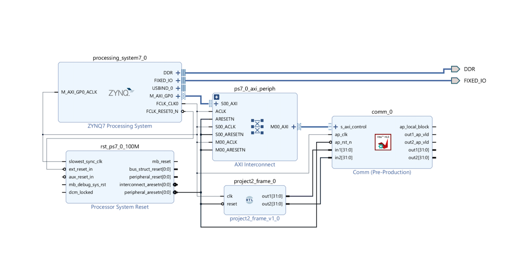

# CS3220 Lab #3 (10 pts) 

100 pts in total, will be rescaled into 11.25% of your final score of the course.  

**Part 0: Env Setup**: 0 pts

**Part 1: Deploy on Pynq-Jupyter**: 100 pts

***Submission ddl***: Oct 9nd

This lab serves as a continuation of Lab #2. The primary aim is to guide you through the process of deploying your RISC-V processor on a Pynq board.

## Part-0: Env Setup (0 pts)

### Accessing Pynq Board

We've settled remote access to the pynq board. Please follow the instructions outlined in this: [document](https://docs.google.com/document/d/1WEvITUjTsU5aGcmtTOyS6S6BRdve-n_P11pqTyLeIaU/edit?usp=sharing). 

*Setting up the environment might take some time. Kindly be patient.*

*Please note that the number of available pynq boards is limited, so please ensure you don't extend your remote session beyond 2 hours.*

### Remote Desktop

In this lab, you'll be working with Vivado and Vitis HLS 2020.2. For the best experience, we recommend accessing the remote desktop. Follow the steps outlinedn in the [above document](https://docs.google.com/document/d/1WEvITUjTsU5aGcmtTOyS6S6BRdve-n_P11pqTyLeIaU/edit?usp=sharing), The only difference is in Step 3: Click on "Synth & Emu" > "Synthesia Desktop" instead.

### Updalod & Download Files

You can access the root directory of your remote machine through your browser. Refer to step 4 of the [above document](https://docs.google.com/document/d/1WEvITUjTsU5aGcmtTOyS6S6BRdve-n_P11pqTyLeIaU/edit?usp=sharing), click on the "data root directory" at the bottom of the screen. The remote desktop and pynq board shares the same data storage, so it is not needed to transfer data between them.

## Part-1: Deployment on Pynq-Jupyter (7pts)

In this part, you will deploy your RISC-V processor on a pynq board. The pynq board is a [field programmable gate array](https://en.wikipedia.org/wiki/Field-programmable_gate_array), which allows you to program its hardware. You will be able to communicate with the board through AXI lite protocol with a Jupyter notebook.

### Step-1: Vitis for Creating a Communication Adapter

In this step, you will generate a communication adapter using [comm.cpp](comm.cpp)in Vitis HLS. This allows you to communicate with the verilog modules (your RISC-V processor) in the field programmable gate array.

The code only defines ports (inputs and output arguments) to verilog modules with memory-mapped connection using AXI lite protocol. So you can consider this vitis code as an communication adapter, and vitis generates most of the necessary logics for us.

For a detailed, step-by-step video demonstration, refer to this [link](https://drive.google.com/file/d/1GYrVq5hJ2KwMEMfOCgT8xiaIQPkq5pFb/view?usp=sharing). Additionally, you may find helpful guidance in the following tutorial: (https://www.hackster.io/whitney-knitter/rapid-prototyping-vitis-hls-ip-designs-using-pynq-f76910). 


### Step-2: Vivado for Bitstream Generation

#### [1] Prepare your codes:

Modify the [pipeline.v](pipeline.v) to have two additional ports and change reset to rest_n, you will interact with it from the CPU (Jupyter Notebook) side through these ports.

Before:

```
module pipeline (
  input wire clk,
  input wire reset
);
```

After:

```
module pipeline(
input clk,
input reset_n, 
output[31:0] out1,
output[31:0] out2
);


wire reset = ~reset_n;  
```

In pipeline.v, connect out1 for cycle_count:

``` 
always @ (posedge clk) begin
  if (reset) begin
    cycle_count <= 0; 
  end else begin
    cycle_count <= cycle_count + 1;    
  end
end

assign out1 = cycle_count;
```

Assigned out2 to any 32-bit number you like:

```
assign out2 = 32'd33;  
```

#### [2] Create a block design

First create a vivado project and a block diagram. Then import the IP repo (the communication adapter) generated step-1, and add the comm IP to the block diagram. 

Please see this [link](https://drive.google.com/file/d/13UJYmOdiZHjuR1avq2HrmpxkNc-HSVaM/view?usp=sharing) for a step by step demonstration.

#### [3] Add the RISC-V processor to the block diagram.

 

#### [4] Connect pipeline

You will need to connect your RISC-V processor with the communication adapter (in1 in common <-> out1, in2 in common <->out2) manually. 
 

#### [5] Add Zynq PS module from IP repo and then use auto-connect features to complete all the connections. 

The procedure for adding zynq ps is the same as how we add the comm IP into the block diagram, as demonstrated in the [video](https://drive.google.com/file/d/13UJYmOdiZHjuR1avq2HrmpxkNc-HSVaM/view?usp=sharing) above. The PS stands for the on-chip processing system (the CPU where will you run the jupyter notebook), which will communicate with the RISC-V processor through AXI lite protocol.

The autoconnect button shows up at the top of the block diagram. Click "Run Connection Automation" and then select all modules, then click OK.

If clock or reset signal connections are missing, you can connect them manually. The final output should be as follows:
 

#### [6] Create HDL wrapper 

Go to “Sources” panel and right click on your block design name, click on “Create HDL wrapper”. Click on “Let Vivado manage wrapper and auto-update” option and click on “OK”. 

Make the design_wrapper as a *top module* by right click it in the source code "Set as Top". 

#### [7] Synthesize/implementation/generate bitstreams

Go to the "Flow Navigator" panel and click "Generate Bitstream" (it will ask to synthesize etc., click yes). The bitstreams is used to tell the FPGA how to program its hardware.

The bistream generation takes around 10 mins, in the bottom of the screen, if you select "Design Runs", you can see the progress.

#### [9] Export the bitstream

Click on File -> Export -> Export block design.

#### [10] Prepare the files

Copy the following files:
+ `[proj_name].runs/impl_1/design_1_wrapper.bit` or where you expored the bitstream in step [9].
+ `[proj_name].runs/impl_1/design_1_wrapper.tcl`
+ `[proj_name].gen/sources_1/bd/design_1/design_1.hwh.`

The name and path may be different if you use different block design name, all the paths are relative path to the project root (where you created the Vivado project).

Make sure you rename all the files to have the same name (e.g. riscv.bit, riscv.tcl, riscv.hwh) 

### Step-3: Deploy on the Pynq Board

#### [11] Upload the files 

Place all generated files in the above step and the [riscv_test.ipynb](riscv_test.ipynb) file in a same folder.  

#### [12] Running on the Pynq Board

Open the [riscv_test.ipynb](riscv_test.ipynb) file on the request Jupyter notebook and run the code, the 0x20 address corresonds to out1 and 0x30 address corresponds to out2, out1 value will keep changing since it's a cycle count and out2 value will be the constant that you put in the beginning of step 2. 
*include the screenshot of ipynb on your report* 

**What to submit** 

A zip file containing your .bit, .tcl, .hwh files;
A screenshot of the jupyter notebook, showing the expected value in step [12].

**Grading policy** 

If the bitstream you submit can be successfully deployed on the pynq board and the value in step [12] are correct, you will receive full credit.
