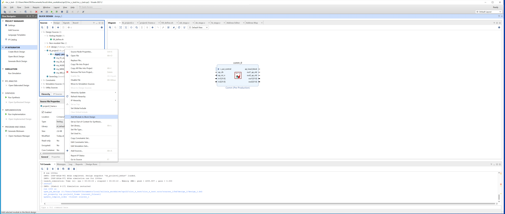
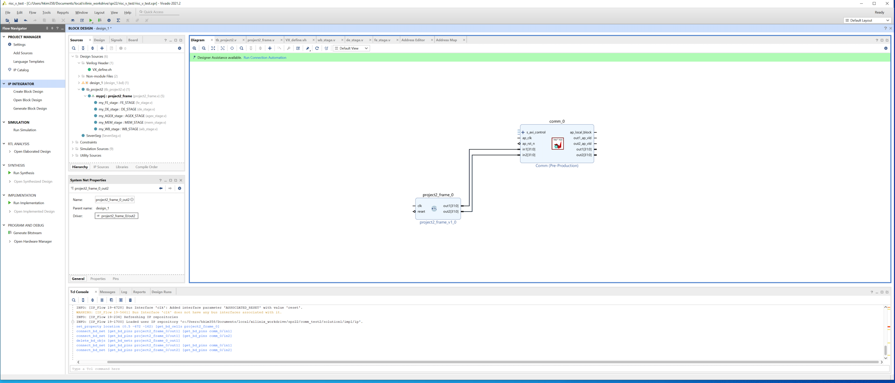

# CS3220 Lab #3 (10 pts) 

This lab continues from Labs #1 and #2. In this session, you will deploy your RISC-V processor on a Pynq board and deepen your understanding of IO protocols.


**Learning Outcomes:**

+ Develop proficiency in creating and utilizing AXI lite ports for communication with your RISC-V processor.

+ Gain hands-on experience with the Vivado and Vitis HLS workflow to deploy hardware designs on FPGAs.

**Lab Structure:**

+ **Part-1:** Step-by-step guidance on using AXI lite for communication with your RISC-V processor.

+ **Part-2:** Apply your knowledge to send instructions to your processor using external inputs via AXI lite.

**Score Distribution:**

The lab is worth a total of 10 points, contributing 12.85% to your final course grade.

+ **Part 0: Env Setup**: 0 pts

+ **Part 1: Deploy your RISC-V CPU on the Pynq Board**: 7 pts

+ **(Bonus) Part 2: Read / Write though AXI Lite**: 3 pts

***Submission ddl***: Feb. 27

## Part-0: Environment Setup <span style="color:blue">Not Ready (TBD after Server Ready)<span style="color:blue">

### Accessing Pynq Board

We've settled remote access to the pynq board. Please follow the instructions outlined in this [document](https://docs.google.com/document/d/1WEvITUjTsU5aGcmtTOyS6S6BRdve-n_P11pqTyLeIaU/edit?usp=sharing). 

Note: Environment setup may take some time. Please be patient. Remember, the availability of Pynq boards is limited; ensure your remote session does not exceed 2 hours.

### Remote Desktop

You will use Vivado and Vitis HLS 2020.2 in this lab. Access the remote desktop for the best experience, where all necessary toolchains are pre-installed. Follow the instructions in the previously mentioned [document](https://docs.google.com/document/d/1WEvITUjTsU5aGcmtTOyS6S6BRdve-n_P11pqTyLeIaU/edit?usp=sharing), selecting "Synth & Emu" > "Synthesis Desktop" at Step 3.

### Updalod & Download Files

Access your remote machine's root directory through your browser as outlined in Step 4 of the [document](https://docs.google.com/document/d/1WEvITUjTsU5aGcmtTOyS6S6BRdve-n_P11pqTyLeIaU/edit?usp=sharing). Click on "data root directory" at the bottom of the screen. Since the remote desktop and Pynq board share the same data storage, transferring data between them is unnecessary.

## Part-1: Deploy your RISC-V CPU on the Pynq Board <span style="color:blue">Ready<span style="color:blue">

In this part, you will deploy your RISC-V processor on a pynq board. The pynq board contains a [field programmable gate array (FPGA)](https://en.wikipedia.org/wiki/Field-programmable_gate_array), which allows you to program its hardware. You will be able to communicate with the board through AXI lite ports using a Jupyter notebook.

### Step-1: Vitis for Creating a Communication Adapter

Use [comm.cpp](comm.cpp) in Vitis HLS to generate a communication adapter. This code defines ports (inputs and outputs) for Verilog modules, facilitating memory-mapped connections via AXI lite protocol. Vitis will automatically generate most of the necessary logic.

For a detailed, step-by-step demonstration, refer to this [video](https://drive.google.com/file/d/1GYrVq5hJ2KwMEMfOCgT8xiaIQPkq5pFb/view?usp=sharing).

### Step-2: Vivado for Bitstream Generation

#### [1] Code Preparation:

Modify [pipeline.v](pipeline.v)  include two additional ports and change the reset to reset_n.

Before:

```
module pipeline (
  input wire clk,
  input wire reset
);
```

After:

```
module pipeline(
input clk,
input reset_n, 
output[31:0] out1,
output[31:0] out2
);


wire reset = ~reset_n;  
```

In [pipeline.v](pipeline.v), connect `out1` for cycle count:

``` 
always @ (posedge clk) begin
  if (reset) begin
    cycle_count <= 0; 
  end else begin
    cycle_count <= cycle_count + 1;    
  end
end

assign out1 = cycle_count;
```

Assigned `out2` to the 10th register:

```
assign out2 = reg10_val;  
```

#### [2] Create a Block Design

Create a Vivado project and a block diagram. Import the IP repository (communication adapter) from Step 1 and add the comm IP to the block diagram. For a step-by-step demonstration, see this [video](https://drive.google.com/file/d/13UJYmOdiZHjuR1avq2HrmpxkNc-HSVaM/view?usp=sharing).

#### [3] Add the RISC-V Processor to the Block Diagram

 

#### [4] Connect Modules

You will need to connect your RISC-V processor with the communication adapter (in1 in common <-> out1 in RISC-V, in2 in common <->out2 in RISC-V) manually. 
 

#### [5] Add Zynq PS Module

The procedure for adding the Zynq PS module is the same as how you add the comm IP into the block diagram (you do not need to import new repo, Vivado has automatically loaded it for you), as demonstrated in the [video](https://drive.google.com/file/d/13UJYmOdiZHjuR1avq2HrmpxkNc-HSVaM/view?usp=sharing). The PS stands for the on-chip processing system (where you run the jupyter notebook), which will communicate with the RISC-V processor through AXI lite.

The autoconnect button shows up at the top of the block diagram. Click "Run Connection Automation" and then select all modules, then click OK.

If clock or reset signal connections are missing, you can connect them manually. The final output should look like the following:
 

#### [6] Create HDL wrapper 

Go to the “Sources” panel and right click on your block design, click on “Create HDL wrapper”. Click on “Let Vivado manage wrapper and auto-update” option and click on “OK”. 

Make the design_wrapper as the *top module* by right click it in the source code and choose "Set as Top". 

#### [7] Synthesize/implementation/generate bitstreams

Go to the "Flow Navigator" panel and click "Generate Bitstream" (it will ask to synthesize etc., click yes). The bitstreams tells FPGA how to program its hardware.

The bistream generation takes around 10 mins, in the bottom of the screen, if you select "Design Runs", you can see the progress.

#### [9] Export the bitstream

Click on File -> Export -> Export bitstream.

#### [10] Prepare the files

Copy the following files:
+ `[proj_name].runs/impl_1/design_1_wrapper.bit` or where you expored the bitstream in step [9].
+ `[proj_name].runs/impl_1/design_1_wrapper.tcl`
+ `[proj_name].gen/sources_1/bd/design_1/design_1.hwh.`
to the same folder.

The name and path may be different if you use different block design name, all the paths are relative path to the project root (where you created the Vivado project).

Make sure you rename all the files to have the same name (e.g. riscv.bit, riscv.tcl, riscv.hwh) 

### Step-3: Deploy on the Pynq Board

#### [11] Upload the Files 

Gather the three files specified earlier along with [riscv_test.ipynb](riscv_test.ipynb) into the same directory.  

#### [12] Running on the Pynq Board

Launch [riscv_test.ipynb](riscv_test.ipynb) within the designated Jupyter notebook environment and execute the code. The address 0x20 corresponds to `out1` and 0x30 to `out2`. The value at `out1` will continuously change, reflecting the cycle count, whereas the value at `out2` will display the static value from the 10th register.

*Please include a screenshot of the Jupyter notebook displaying the output in your report.* 

## Dispatch Instructions to Your Processor with AXI Lite <span style="color:blue">Ready<span style="color:blue">

In Part 1, you learned to add output ports to your RISC-V processor and read values using AXI Lite. Real-world applications often require both reading outputs and sending inputs to the processor. In Part 2, you will:

1. Add an input port to your RISC-V processor.;
2. Dispatch instructions to your processor and verify the execution results.

### Step-1: Revise Your Code

Similar to Step-2 in Part-1, you will begin by adding a 32-bit input port to [pipeline.v](pipeline.v). Next, assign this input value to `inst_FE` in [fe_stage.v](fe_stage.v), so that the processor takes the input as the instruction.

### Step-2: Bitstream Generation

The bitstream generation process for the revised RISC-V design mirrors that of Step-2 in Part-1. The only difference is that you now need to connect the newly added input port to the communication adapter.

### Step-3: Deploy on the Pynq Board

Follow the instructions from Part-1 to upload your design to the Pynq Board. Then, load your processor design using [riscv_test2.ipynb](riscv_test2.ipynb).

### Step-4: Dispatch Instructions to Your Processor

After loading your processor design, you will be able to send arbitrary instructions through the newly added input port. Your task is to change the value of the 10th register to 10, refer to this [online compiler](https://riscvasm.lucasteske.dev/#) to convert your assembly instruction into a binary code. The value of the 10th register can be accessed via `out2` from the Jupyter notebook.

## Submission Guideline

**What to submit** 

+ **Part-1:** Submit a zip file containing your `.bit`, `.tcl`, and `.hwh` files along with a screenshot of the Jupyter notebook demonstrating the expected values from Step-3 of Part-1.

+ **Part-2:** Submit a zip file containing your .bit, .tcl, and `.hwh` files, plus a screenshot of the Jupyter notebook demonstrating the expected values from Step-4 of Part-2.

**Grading policy** 

You will receive full credit for each part if the submitted bitstream can be successfully deployed on the Pynq board and the provided screenshots accurately display the correct outputs.
