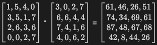
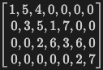
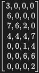
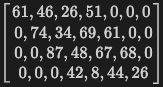
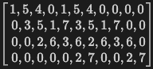
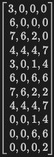
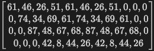

# CS3220 Lab #7 : Systolic Array Design and Integration with RISC-V CPU with AXI4

100 pts in total, will be rescaled into 12.85% of your final score of the course.  

**Part 1: Systolic Array**: 100 pts

**Bonus: Systolic Array with RISC-V and AXI4**: 20 pts

***Submission ddl***: Dec 4th

In this lab, you will explore the design of a systolic array and its integration with a RISC-V CPU using the AXI4 protocol. Systolic arrays, first introduced in the late 1980s, have since become a fundamental tool for a wide range of applications, spanning from scientific computing to machine learning. The core concept revolves around employing a regular grid of simple processing elements (PEs) to execute computations in a data-flow fashion. These PEs are interconnected in a structured manner, facilitating the streaming of data through the array. The systolic array architecture excels in efficiently handling tasks such as matrix multiplication, convolution, and other linear algebra operations. An exemplary illustration of this concept can be found in the Google TPU, which leverages systolic arrays and vector machines. One of the major key features of systolic arrays is the systolic data propagation, which is a very efficient and scalable way to move data through the array, which we will focus a lot in this lab.

## Part 1: Systolic Array:

In this section, you'll finish the implementation of a 4x4 systolic array, with output stationary design. We will focus only on the matrix multiplication operation. 

Please be sure to read through the original systolic array paper before you start: 

- [link1](https://www.princeton.edu/~kung/papers_pdf/New%20Folder/VLSI%20Array%20Processors.pdf) 

To enhance your comprehension and offer more specific guidance on implementation, we have included a tutorial report detailing the systolic array design and implementation. This report will direct you on where to begin and outline the necessary steps:
- [link2](CS3220_systolic_array_luke_zhang.pdf)

The code skeleton is provided in: 
- [systolic_array_4_4.v](systolic_array_4_4.v)
- [MAC.v](MAC.v)
- [ctrl.v](ctrl.v)

Finish all the TODOs in the code; or you can start from scratch if you prefer.

Useful hints:
- Pay very special attention to the timing of the signals. At what clock cycle should the sigals be expected?
- What if two signals are expected to arrive at the same time? But one of them is a little falling behind? Remember Flip-Flop is a very useful tool to help you with this; output of a Flip-Flop is always one clock cycle behind the input; can you use this to help you with the timing?
- Do you know what line383 in [systolic_array_4_4.v](systolic_array_4_4.v) is doing? Why is it needed? What if you remove it?
- generate block in Verilog is a good way to save repetitive code.


Testing pattern and assumptions:
- The input data will be pre-skewed and pre-rotated. You don't need to implement the skewing and rotating logic. For example:
    - For matrix mulitplication A*B=C: 

    - A: Streamed to ```row_data_in``` [systolic_array_4_4.v](systolic_array_4_4.v) from left to right as (note topmost is the first row): 
    - B: Streamed to ```col_data_in``` [systolic_array_4_4.v](systolic_array_4_4.v) from top to bottom as (note leftmost is the first column): 
    - C: Expected to be streamed out from ```row_data_out``` [systolic_array_4_4.v](systolic_array_4_4.v) from left to right as (note topmost is the first row): 
- Multiple matrix multiplication operations will be performed in sequence. Your design is expected to be able to handle the next matrix multiplication operation immediately after the previous one is finished.
    - Assume the same matrix multiplication operation as above is performed again, the input data will be streamed in the same way as above.
    - A: Streamed to ```row_data_in``` [systolic_array_4_4.v](systolic_array_4_4.v) from left to right as (note topmost is the first row): 
    - B: Streamed to ```col_data_in``` [systolic_array_4_4.v](systolic_array_4_4.v) from top to bottom as (note leftmost is the first column): 
    - C: Expected to be streamed out from ```row_data_out``` [systolic_array_4_4.v](systolic_array_4_4.v) from left to right as (note topmost is the first row): 

Test script, a random number of tests from 4 to 8 doing 4x4 matrix multiplication will be performed. You can run the test script by:

```make systolic_array```


## Bonus: Systolic Array with RISC-V and AXI4

Integrate the RISC-V design, axi4, and systolic array together.

RISC-V memory preparation:
- Modify the RISC-V memory content to store the input matrix A and B, and the expected output matrix C. Use similar format as [lab5](https://github.com/gt-cs3220-23fall/cs3220-labs/blob/master/lab5/test/part7/alutest2.S).
- Load the memory content to the RISC-V memory using ```lw```
- Modify axis_fifo from [lab6](https://github.com/gt-cs3220-23fall/cs3220-labs/blob/master/lab6/axis_data_fifo.v) to connect the RISC-V to the systolic array. With the help of axis_fifo module, the RISC-V will write the input matrix A and B to the systolic array, and read the output matrix C from the systolic array in similar way as this lab.
- Store the result (matrix C content) in another scratchpad memory using axi4_ram from [lab6](https://github.com/gt-cs3220-23fall/cs3220-labs/blob/master/lab6/axi4_ram.v). This action is expected to be performed during runtime, i.e., as the output data (matrix C content) is streamed in, you need to store the data in the scratchpad memory immediately. You should NOT wait until the systolic array finishes all the computation, and then store the data in the scratchpad memory.
- Store the scratchpad memory content to file.
- Write a test script (either C/CPP or python; if using C/CPP, please attach make scripts). Compare the scratchpad memory content with the expected output matrix C; also print out the input. 

## Submission

+ Provide a zip file containing your source code. Generate the submission.zip file using the command `make submit`. Avoid manual zip file creation to prevent any issues with the autograding script, which could lead to a 30% score deduction.
* Please also submit a screenshot of your final couse survey submission. 


* Late submission policy: 3 hours grace period for potential canvas submission issues; 10% per day late, up to 3 days. No credit will be given for submissions later than 3 days.


## FAQ 
[Q] Useful lecture links for systolic array design?

https://www.youtube.com/watch?v=cmy7LBaWuZ8&pp=ygUPc3lzdG9saWMgYXJhYXkg 

